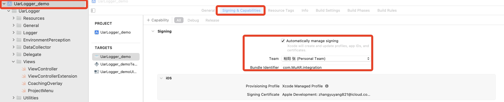
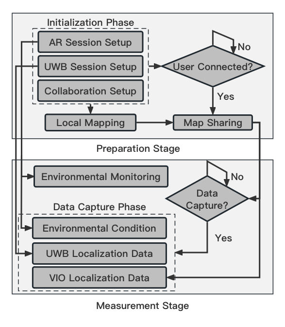

# UarLogger: 
 
## Overview

### Key Contribution: 
* Design an iOS application to record UWB and VIO localization data between two users simultaneously and monitor some environmental conditions like lighting, which could be a useful tool for further research.
* Compare VIO and UWB localization under different contexts to prove the effectiveness of the app tool.
* Integrate UWB and VIO localization data using kalman filtering when user shake the device, improving localization accuracy under such condition.

## Getting started

### Dependencies
* Python 3.0 or above
* Xcode 14.0 or above
* Two iOS devices with iOS version 16.0 or higher (Nearby Interaction requirement)

## Directories
* UarLogger_GUI: iOS application section
* python: backend analysis script and kalman filter

## Version
* 0.1
    * Initial Release

## Tutorial & Remarks

### Signing
* Login your __Apple account__ and choose that as your team
* Setting __Bundle Identifier__ to the form of __com.xxx.yyy__ or __com.xxx.yyy.zzz__
* 

### Data Extration from iOS Devices to Mac or Other PCs
* Step 1: connect iOS device and PC by data cable
* Step 2: open "Window-Device and Simulators" menu
* Step 3: choose "integration" row, press circle shape button below, then choose download container option
* Step 4: find the relating data folders and save into PC.

### Application Flowchart
* 
 
## Citations
Inspired by
* [ScanKit] {https://github.com/Kenneth-Schroeder/ScanKit }
* [ARKit] {https://developer.apple.com/augmented-reality/ }
* [Nearby Interaction Demo] { [https://docs-assets.developer.apple.com/published/9e06bcddfa/ImplementingInteractionsBetweenUsersInCloseProximity.zip] }
* [Multipeer Connectivity] {https://developer.apple.com/documentation/multipeerconnectivity }
